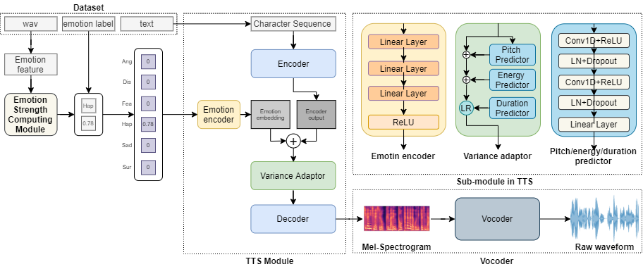
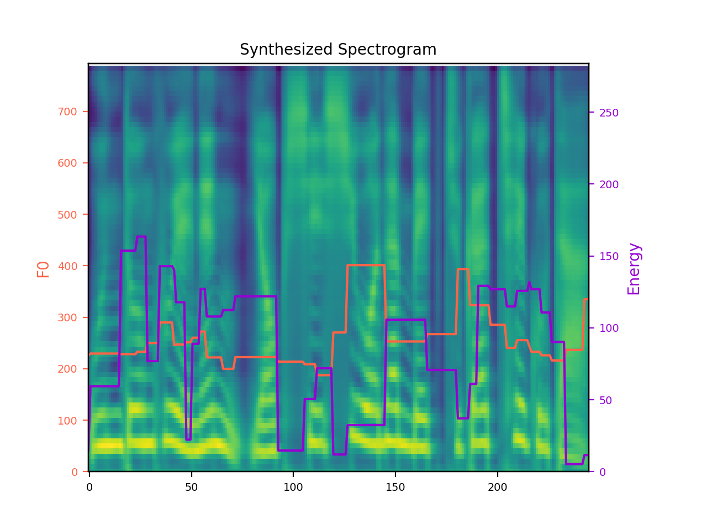

# Emotion Controllable Text-to-Speech based on FastSpeech 2 


# Introduction
Recently, speech synthesis research has developed rapidly, and many studies are now underway on Emotional Text-to-Speech (ETTS). However, there are many challenges with ETTS. Not only is it accompanied by considerable financial problems, but it is even more impossible to obtain the emotional strength label data. In this paper, we propose an unsupervised emotion labeling method and a controllable ETTS model to solve these problems. Emotion scores are given to emotion speech data using relative ranking functions, which are converted to emotion vectors and used as conditions in speech synthesis models. The emotion vector represents the emotion category and strength, which makes it easy to control emotional information. Experiments show that the proposed model controlled via emotion vectors can synthesize natural, emotion-expressive speech.

Implementation by PyTorch

Language: Korea

# Train
```
python train.py
```

# Synthesis
```
python synthesis.py --step 500000
```

# Train and synthesis results
## Pretrained model
### FastSpeech2 
[https://drive.google.com/file/d/1_YyQsmE4Dtxl-J5eXJnmcO4O7KKFLmmv/view?usp=sharing](https://drive.google.com/file/d/1_YyQsmE4Dtxl-J5eXJnmcO4O7KKFLmmv/view?usp=sharing)

### Hi-Fi GAN
[https://drive.google.com/file/d/1nqPDjqEr1oq0T7ezuZTfhBKMtHQgmHOL/view?usp=sharing](https://drive.google.com/file/d/1nqPDjqEr1oq0T7ezuZTfhBKMtHQgmHOL/view?usp=sharing)

## Training visualizing


## Melspectrogram, f0, energy


## Demo page
[https://hsoh0306.github.io/2021/06/11/cetts-demo/](https://hsoh0306.github.io/2021/06/11/cetts-demo/)


# References
[1]X. Cai, D. Dai, Z. Wu, X. Li, J. Li, and H. Meng. Emotion controllable speech synthesis using emotion-unlabeleddataset with the assistance of cross-domain speech emotion recognition. InICASSP 2021-2021 IEEE InternationalConference on Acoustics, Speech and Signal Processing (ICASSP), pages 5734–5738. IEEE, 2021.

[2]O. Chapelle. Training a support vector machine in the primal.Neural computation, 19(5):1155–1178, 2007.

[3]F. Eyben, F. Weninger, F. Gross, and B. Schuller. Recent developments in opensmile, the munich open-sourcemultimedia feature extractor.  InProceedings of the 21st ACM international conference on Multimedia, pages835–838, 2013.

[4]S. Kim, S. Bae, and C. Won. Open-source toolkit for end-to-end korean speech recognition.Software Impacts,7:100054, 2021.

[5]J. Kong, J. Kim, and J. Bae.  Hifi-gan:  Generative adversarial networks for efficient and high fidelity speechsynthesis.Advances in Neural Information Processing Systems, 33, 2020.

[6]Y.  Lee,  A.  Rabiee,  and  S.-Y.  Lee.Emotional  end-to-end  neural  speech  synthesizer.arXiv preprintarXiv:1711.05447, 2017.

[7]T. Li, S. Yang, L. Xue, and L. Xie. Controllable emotion transfer for end-to-end speech synthesis. In2021 12thInternational Symposium on Chinese Spoken Language Processing (ISCSLP), pages 1–5. IEEE, 2021.

[8]B. McFee, C. Raffel, D. Liang, D. P. Ellis, M. McVicar, E. Battenberg, and O. Nieto. librosa: Audio and musicsignal analysis in python. InProceedings of the 14th python in science conference, volume 8, 2015.

[9]D. Parikh and K. Grauman.  Relative attributes.  In2011 International Conference on Computer Vision, pages503–510. IEEE, 2011.

[10]Y. Ren, C. Hu, X. Tan, T. Qin, S. Zhao, Z. Zhao, and T.-Y. Liu. Fastspeech 2: Fast and high-quality end-to-endtext to speech. InInternational Conference on Learning Representations, 2021.

[11]Y. Ren, Y. Ruan, X. Tan, T. Qin, S. Zhao, Z. Zhao, and T.-Y. Liu. Fastspeech: Fast, robust and controllable text tospeech. In H. Wallach, H. Larochelle, A. Beygelzimer, F. d'Alché-Buc, E. Fox, and R. Garnett, editors,Advancesin Neural Information Processing Systems, volume 32. Curran Associates, Inc., 2019.

[12]J. Shen, R. Pang, R. J. Weiss, M. Schuster, N. Jaitly, Z. Yang, Z. Chen, Y. Zhang, Y. Wang, R. Skerrv-Ryan,et al. Natural tts synthesis by conditioning wavenet on mel spectrogram predictions. In2018 IEEE InternationalConference on Acoustics, Speech and Signal Processing (ICASSP), pages 4779–4783. IEEE, 2018.

[13]S.-Y. Um, S. Oh, K. Byun, I. Jang, C. Ahn, and H.-G. Kang. Emotional speech synthesis with rich and granularizedcontrol.  InICASSP 2020-2020 IEEE International Conference on Acoustics, Speech and Signal Processing(ICASSP), pages 7254–7258. IEEE, 2020.

[14]Y. Wang, R. Skerry-Ryan, D. Stanton, Y. Wu, R. J. Weiss, N. Jaitly, Z. Yang, Y. Xiao, Z. Chen, S. Bengio, et al.Tacotron: Towards end-to-end speech synthesis.Proc. Interspeech 2017, pages 4006–4010, 2017.

[15]Y. Wang, D. Stanton, Y. Zhang, R.-S. Ryan, E. Battenberg, J. Shor, Y. Xiao, Y. Jia, F. Ren, and R. A. Saurous.Style tokens: Unsupervised style modeling, control and transfer in end-to-end speech synthesis. InInternationalConference on Machine Learning, pages 5180–5189. PMLR, 2018.

[16]X. Zhu, S. Yang, G. Yang, and L. Xie. Controlling emotion strength with relative attribute for end-to-end speechsynthesis. In2019 IEEE Automatic Speech Recognition and Understanding Workshop (ASRU), pages 192–199.IEEE, 2019